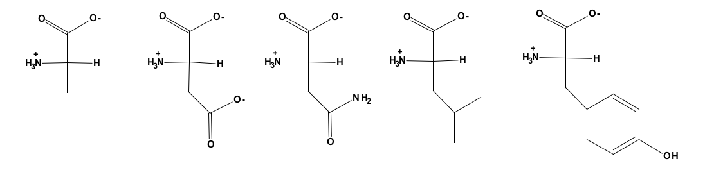

(ref:abstract) Lab reports typically require a significant amount of data analysis that must be presented in a highly structured form. RMarkdown allows the combining of data analysis and writeup into a single document. The present work outlines the process of creating a lab report using RMarkdown. Formatting considerations and data analysis are considered.

```{r setup, include=FALSE}
knitr::opts_chunk$set(echo = TRUE)
```

## R Markdown

This is an R Markdown document. Markdown is a simple formatting syntax for authoring HTML, PDF, and MS Word documents. For more details on using R Markdown see <http://rmarkdown.rstudio.com>.

When you click the **Knit** button a document will be generated that includes both content as well as the output of any embedded R code chunks within the document. You can embed an R code chunk like that shown in Table\ \@ref(tab:cars). The table also shows the functionality of one of the helper functions of knitr [@R-knitr].

```{r cars}
knitr::kable(summary(cars), caption="Statistical summary of the data in the built-in data frame cars.")
```

Sometimes you may need to include some modified fonts, to discuss topics like the &pi;-electrons of C~6~H~6~.

## Including Plots

You can also embed plots, for example:

(ref:pressure) Plot of vapor pressure (open circles) as a function of temperature for mercury. 

```{r pressure, echo=FALSE, fig.cap='(ref:pressure)'}
plot(pressure, xlab=expression(paste("Temperature (",degree*C,
                                     ")")),
     ylab="Pressure (mm Hg)")
```

Note that the `echo = FALSE` parameter [@gagnon_fluorine-tagged_2010] was added to the code chunk producing Figure \@ref(fig:pressure) to prevent printing of the R code that generated the plot [@R-base].

If you have an image to include, rather than a plot to create from data, there are Markdown commands to include images.



(ref:acids) Five amino acids with very different solubilities in water. From left, alanine, aspartate, asparagine, leucine, tyrosine.

It might take advantage of more of the features of knitr, though, to use another of the knitr helper functions in an R code block.
```{r acids, fig.cap='(ref:acids)'}
knitr::include_graphics('adnly.png', dpi=NA)
```


## Equations

RMarkdown can also include equations. These are entered using LaTeX format.

\begin{equation}
  [P]_{bound}=\frac{[P]_{total}[L]^n}{[L]^n+[L]_{0.5}^n}
  (\#eq:hill)
\end{equation}

If the equation is appropriately labeled, the equation will be numbered. References to the equations, like to Equation \@ref(eq:hill), should also work.

## References

```{r}
knitr::write_bib(c("base", "knitr"), "knitr.bib")
```


